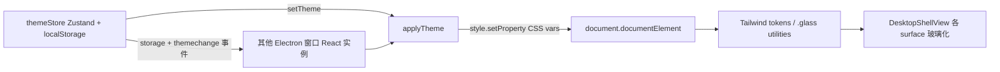

## 用户需求

对现有 Electron + React 桌面 OCR 应用（所有界面集中在 `src/views/DesktopShellView.tsx` 的 panel/result/settings/long-toolbar/overlay 五个 surface）进行整体风格重构，全面采用毛玻璃（Glassmorphism）视觉设计。

## 产品概述

将所有窗口界面改造为通透、现代的毛玻璃风格：半透明背景叠加高斯模糊、半透明细边框、轻投影，主色调为清爽蓝色并搭配浅蓝与中性色过渡营造层次；同时在设置页提供可实时切换的动态主题色。

## 核心特性

- **毛玻璃视觉体系**：所有容器/卡片/输入区采用半透明背景（浅色 `bg-white/40`、深色 `bg-white/5`）+ `backdrop-blur-xl` 高斯模糊 + 半透明细边框 + 轻投影，背景层为蓝色渐变（浅蓝→中性过渡）。
- **蓝色主色与层次**：主色由当前薄荷青（hue 185）改为清爽蓝（OKLCH hue≈255），搭配浅蓝与中性过渡色，通过透明度和模糊营造纵深。
- **全组件样式更新**：更新 Card、Button 及 DesktopShellView 各 surface 的视觉，使统一呈现玻璃质感，同时保持原有 flex/grid 响应式布局不变。
- **文字高对比可读**：玻璃背景上正文使用高不透明度前景色，按 light/dark 自动取深/浅前景，关键文本避免低透明。
- **动态主题色配置（设置页）**：新增「主题色」选择区，提供红、橙、黄、绿、青、蓝、紫七色系；点击后基于基础色相自动计算并生成对应的浅色过渡与中性配色及背景渐变，全局样式实时更新并跨窗口同步。

## 技术栈

- 框架：React 18 + TypeScript + Vite，Electron 43 桌面宿主（多窗口 + vibrancy）
- 样式：Tailwind CSS v4（CSS-first，`src/default.css` 中 `@theme inline` + CSS 变量），shadcn/ui 组件
- 状态：Zustand（参考 `src/auth/AuthStore.ts` 的 create + localStorage 模式）
- 色彩：OKLCH 色彩空间（与现有 `default.css` 一致）

## 实现方案

### 总体策略

在不改动布局结构与 Electron 窗口配置的前提下，把「不透明实体色」替换为「主题驱动 + 半透明玻璃」。Theme 以 CSS 变量为唯一真相源：预设色相 → `buildTheme()` 用 OKLCH 曲线推导全套 token 及背景渐变 → 写入 `document.documentElement` 的 CSS 变量，Tailwind 颜色与组件类即时生效，实现全局实时更新。

### 关键技术决策

1. **主题驱动而非硬编码**：在 `default.css` 将 `--primary/--secondary/--muted/--accent/--border/--ring` 等改为可由 JS 覆盖的变量；新增 `--app-bg-gradient` 用于 `html` 背景。运行时 `applyTheme()` 通过 `style.setProperty` 覆盖 `:root`，O(1) 开销，仅触发一次样式重算。
2. **蓝色玻璃背景**：`html` 设置主题渐变（浅蓝 → 中性），`body`/`#root` 改 `transparent` 以露出 macOS vibrancy 与渐变；overlay/long-toolbar 仍保持透明（截图层不受影响）。
3. **七色自动推导**：每色定义基础 `hue` + `chroma`，`buildTheme(hue, chroma)` 按固定曲线生成 primary/secondary/muted/accent/ring 及浅色过渡（更亮更淡的 tint）与中性色（降饱和），并合成背景渐变。默认主题=蓝（用户指定主色调），其余六色可选。
4. **跨窗口同步**：Zustand store 持久化到 localStorage（`app-theme`）。Electron 同 session 多窗口共享 localStorage，`storage` 事件 + 自定义 `themechange` 事件实现跨窗口/同窗口实时同步，无需改动主进程。
5. **可读性与性能**：玻璃容器用浅色半透明（浅色模式），正文前景取深色高不透明；`backdrop-blur` 为 GPU 加速，窗口小、层级浅，无性能瓶颈；避免在滚动列表内多层嵌套模糊。

### 复用与防爆半径

- 复用现有 `cn()`、`Zustand` 模式、shadcn 组件接口；Card/Button 仅调整类与 token，不破坏 API。
- 保留 `DesktopShellView` 五个 surface 的布局 class 与交互逻辑，仅替换背景/边框/模糊相关 class。
- `electron/main.mjs` 的 `vibrancy`/`transparent` 保持不变（body 透明后 vibrancy 自然透出），降低改动风险。

## 实现要点

- `default.css`：`--card/--muted/--secondary/--popover` 改为半透明；新增 `.glass`/`.glass-strong` 工具类（`backport-blur-xl` + 半透明底 + 细边框 + 轻投影）；`::selection` 与 `::-webkit-scrollbar-thumb` 由硬编码 teal 改为 `var(--primary)`；`body`/`#root` 透明，`html` 使用 `var(--app-bg-gradient)`。
- `theme.ts`：导出 `THEME_PRESETS`（7 项）与 `buildTheme(preset)`、`applyTheme(preset)`。
- `themeStore.ts`：`useThemeStore` 含 `theme` 与 `setTheme`，persist 到 localStorage。
- `useTheme.ts`：挂载时应用当前主题，监听 `storage` 与 `themechange` 实时重绘。
- `DesktopShellView.tsx`：各 surface 容器/卡片/输入框/页脚改为玻璃类；settings 的 `CardContent` 内（Auto-launch 之后、Separator 之前）新增主题色选择区（7 个圆形色板，选中态加 ring，点击 `setTheme` 并触发自定义事件）。
- `card.tsx`：基础类增加 `backdrop-blur-xl`，配合半透明 `--card` 自动玻璃化。

## 架构设计



## 目录结构

```
src/
├── default.css                  # [MODIFY] 重定义蓝色玻璃主题 token；新增 .glass/.glass-strong 工具类；html 渐变背景、body 透明；selection/scrollbar 跟随 --primary；移除硬编码 teal
├── lib/
│   ├── theme.ts                 # [NEW] THEME_PRESETS（红橙黄绿青蓝紫 7 项基础 hue/chroma）；buildTheme() 用 OKLCH 推导全套 token + 背景渐变；applyTheme() 写入 :root
│   ├── themeStore.ts            # [NEW] Zustand store（theme + setTheme），persist 到 localStorage（app-theme），并 dispatch themechange 事件
│   └── useTheme.ts              # [NEW] 挂载时应用主题；监听 storage 与 themechange 跨窗口/跨实例实时重绘
├── components/ui/
│   └── card.tsx                 # [MODIFY] 基础类增加 backdrop-blur-xl，配合半透明 --card 实现玻璃卡片
└── views/
    └── DesktopShellView.tsx     # [MODIFY] 将 panel/result/settings/long-toolbar 容器与卡片改为玻璃样式；settings 新增动态主题色选择区；顶部挂载 useTheme
```

## 关键代码结构

```typescript
// src/lib/theme.ts
export type ThemeKey = 'red' | 'orange' | 'yellow' | 'green' | 'cyan' | 'blue' | 'purple';
export interface ThemePreset { key: ThemeKey; label: string; hue: number; chroma: number; }
export interface ThemeTokens { [cssVar: string]: string; '--app-bg-gradient': string; }
export function buildTheme(preset: ThemePreset): ThemeTokens;
export function applyTheme(key: ThemeKey): void;
```

## 设计风格

采用 Glassmorphism（毛玻璃）风格，以清爽蓝为主色，配合浅蓝与中性灰的柔和过渡，营造通透、有层次的现代桌面界面。背景为蓝→浅蓝→中性色的柔和渐变，所有面板、卡片、输入框、按钮容器为半透明白色叠加 `backdrop-blur` 高斯模糊，边缘为半透明白色细边框并带极轻投影，hover 时边框与背景微亮、轻微上浮。设置页主题色选择器为 7 个圆形色板，选中态以主色 ring 高亮，切换时全局实时换色并带 200ms 平滑过渡。

## 页面模块（基于现有 5 个 surface，布局不变）

- 顶部栏（panel/result/settings）：玻璃条 + 圆角图标徽标 + 关闭按钮（hover 转红）。
- 主操作区（panel）：两张玻璃主操作卡（普通/长截图），hover 边框转主色、轻微放大。
- 结果区（result）：玻璃文本框 + 底部玻璃操作条 + 内嵌高级功能玻璃面板。
- 设置区（settings）：玻璃卡片内置快捷键、开机自启，新增「主题色」玻璃选择区。
- 长截图工具条（long-toolbar）：维持现有玻璃条样式并统一参数。

## Agent Extensions

### Skill

- **tailwind-design-system**
- 用途：指导在 Tailwind CSS v4 中设计可扩展的主题 token 体系与 `.glass` 工具类，落地蓝色玻璃设计系统。
- 预期结果：default.css 的 token 与工具类结构清晰、可随主题变量实时更新、符合 v4 最佳实践。
- **frontend-design**
- 用途：对 DesktopShellView 各 surface 与设置页主题选择器进行高质量毛玻璃视觉设计，保证通透、统一、现代。
- 预期结果：所有界面呈现一致的玻璃质感与高对比可读性，设置页主题色板美观且交互明确。
- **animation-best-practices**
- 用途：为玻璃面板/按钮/主题切换添加平滑过渡与 hover 微动效（边框提亮、轻微上浮、200ms 换色过渡）。
- 预期结果：交互流畅无闪烁，毛玻璃界面具备精致微动画而不影响性能。